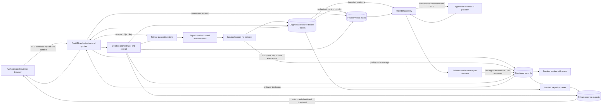

# Proposed architecture and threat model

Status: design proposal. Current implementation and evidence are in [audit.md](audit.md); this document does not describe deployed guarantees.

## Incremental technical direction

Retain React and FastAPI. Introduce a durable relational job/outbox model, an authorized storage abstraction and a source-preserving parser contract before replacing model providers or building additional dashboards. Postgres is the proposed pilot database for constraints, concurrency and optional row-level defense; the repository currently uses hardcoded SQLite. Verify infrastructure before choosing a migration path. No migrations were run in this audit.

Chroma can remain for a bounded single-host pilot if access, namespace lifecycle, backups and concurrency are tested. Evaluate consolidation into a relational vector extension only on measured operational benefit; a new vector engine does not solve authorization. Prefer local embeddings when quality permits; pin and prepackage weights so cold starts do not unexpectedly download assets.

## Data flow and boundaries

Trust boundaries: browser/Internet→API; API→private stores; untrusted bytes→parser sandbox; private text→external provider; model output→validated application records; records→export markup; active stores→backup domain. The browser never receives storage credentials or chooses a tenant namespace. Logs, backups and provider copies are separate retained copies and belong in the deletion inventory.

## Proposed records and invariants

| Record | Essential fields / invariant |
|---|---|
| Workspace, Membership | principal, role, status; membership enforced server-side on every operation |
| Document | workspace_id, owner_id, opaque_id, sanitized display_name, retention_until, tombstoned_at; no filename in object path |
| DocumentVersion | document_id, version, SHA-256, size, signature/type, immutable source key, actual page count, declared expected pages; unique workspace hash policy without global dedup disclosure |
| ReviewContext | version, contract_type, party entity/role, governing_law, forum, objectives, playbook_version, confirmation/source for each |
| ParseRun, SourceBlock | parser/version/settings, OCR mode/language, source hash; block ID, page/section/table-cell, ordered text, normalized offset map, PDF bounding boxes where available |
| Clause, Chunk | stable IDs, parent section, block/span references, token count and overlap provenance; all readable blocks accounted for |
| AnalysisRun | input versions, model/provider, prompt hash/version, parsing/embedding versions, evaluation release, coverage, stage outcomes, tokens/costs, generation mode |
| Finding | immutable generated observation; issue type, supporting span IDs, exact quotes, impact/rationale, evidence status, preference source, applicability limits; no invented source for absence |
| ReviewDecision | actor/time, finding and run version, decision, reason/note, edited draft, revision/ETag; immutable event history plus current projection |
| QuestionAnswer | document/context/run version, question, factual claims with source spans, abstention reason and retrieval diagnostics; same retention as document |
| Comparison | two owned document versions/context, many-to-many clause alignments, match evidence/status, substantive field changes and decisions |
| Job/Outbox | idempotency key, state, stage, attempt, lease owner/expiry, cancellation epoch, retry budget, input hash, progress counters |
| Export / DeletionReceipt | source snapshot IDs, actor, export scope/hash/expiry; per-store purge results, exceptions, backup expiry and correlation ID |

Foreign keys and workspace predicates apply to all related rows. No model output may set owner IDs, storage keys, privileges or arbitrary external URLs. Source quote verification uses exact normalized text plus reversible source mapping; a quote matching another document is invalid. Repeated text needs distinct span IDs, not a global text lookup. DOCX logical positions persist even if rendered page numbers change.

## API contract proposal

All IDs are opaque; access is checked against authenticated membership and document role. Return a consistent non-disclosing not-found response for foreign documents. Use secure HttpOnly/SameSite session cookies and CSRF protection for mutations if cookie authentication is chosen, or verified short-lived bearer tokens with a reviewed browser storage strategy. Exact CORS origins, HTTPS and transport/security headers are configuration gates. Rate-limit by principal/workspace/IP, with quotas before provider calls.

| Operation | Proposed behavior |
|---|---|
| POST /documents | Stream bounded upload with context and Idempotency-Key; 202 with document/job ID; reject oversize early with 413 |
| GET /documents | Cursor-paginated authorized library, no complete analyses in list payload |
| GET /documents/{id}/versions/{v}/pages/{p} | Authorized source rendering/text, short-lived scoped asset access and safe content type |
| GET /jobs/{id} | Authorized stage, counters, safe reason_code, retry_after, partial coverage |
| POST /jobs/{id}/retry or /cancel | Authorized, idempotent transition; enforce retry/cost budget and deletion tombstone |
| GET /reviews/{id}/findings | Paginated findings and span links; explicit incomplete stages |
| PATCH /findings/{id}/decision | Reviewer capability, If-Match version, 409 conflict without lost edits |
| POST /reviews/{id}/questions | Bounded question/context, validated factual claims or explicit abstention; no live fallback |
| POST /comparisons | Two version IDs; authorize both and verify context compatibility before querying either |
| POST /exports | Authorized immutable snapshot and format/scope; 202 then expiring download |
| DELETE /documents/{id} | Tombstone + purge job in transaction; 202 and receipt; repeated request safe |

These names are planning contracts, not additional routes created by this audit. Migration compatibility should use an explicit API version rather than silently changing old response shapes.

## Ingestion and processing

1. Enforce request/stream limits at reverse proxy and application, including missing/false Content-Length and chunked transfer. Bound aggregate comparison upload and concurrent uploads. Stream to quarantine while hashing; do not fully buffer before the limit. Partial upload timeout cleans its object.
2. Generate storage keys independent of filename; preserve a sanitized display name only. Verify extension, signature and parser-recognized structure together. TXT requires accepted encoding/decoding quality; DOCX requires a valid expected OOXML package, disallows executable/embedded objects under pilot policy. Do not treat MIME supplied by browser as truth.
3. Inspect ZIP entry count, paths, total expansion, compression ratios and nesting before parsing DOCX; reject suspicious packages. Enforce sandbox CPU, RAM, wall-clock, page and extracted-token limits for PDF and DOCX. Proposed pilot bounds: 10 MiB/file, 50 pages, 100 MiB expanded DOCX, 2,000 entries, no nested archives, 60 s parser wall time and 512 MiB RAM; tune using fixtures and actual resource measurements before release.
4. Quarantine and scan before exposing a download or calling AI. No upload to public malware-analysis services. Scanner is one layer, not proof of safety. Use isolated non-root/no-network parser and render workers, read-only base filesystem and bounded temporary storage; never follow external document relationships. Candidate content disarm is optional only with provenance and fidelity evaluation.
5. Parse pages/paragraphs/tables with logical order and original mapping. Detect low text coverage, OCR uncertainty, malformed structures and page-number discontinuities. Flag invisible/overlaid text discrepancies for inspection. No complete-analysis state for empty extraction. Unsupported image-only scans abstain until OCR capability is gated.
6. Commit parse manifest, immutable blocks and outbox stage completion. Index versioned chunks under workspace/document/version scope; vector scope comes from authorized DB records. Publish analysis only after schema/evidence/coverage validation. Reconciliation cleans abandoned objects and incomplete indexes.

This defense-in-depth approach follows the [OWASP file upload guidance](https://cheatsheetseries.owasp.org/cheatsheets/File_Upload_Cheat_Sheet.html); the numerical limits above are product hypotheses.

## Jobs, sessions and recovery

Use a DB-backed job runner with an outbox initially, or a managed durable queue with equivalent delivery semantics. Expect at-least-once delivery. Stage idempotency key includes document hash, context version and pipeline version. Unique constraints prevent duplicate AnalysisRuns for the same operation. Workers acquire leases and heartbeat; restart resumes/checkpoints rather than leaving “processing” forever. Dead-letter exhausted jobs, expose safe failure codes and alert on age.

Create/close one SQLAlchemy session per worker transaction; rollback failed transactions before recording failure in a clean transaction. Do not hold a DB transaction during provider calls. [SQLAlchemy session guidance](https://docs.sqlalchemy.org/en/20/orm/session_basics.html) informs these boundaries. DB, object and vector operations require a saga/outbox with reconciliation, not an assumed cross-store transaction.

Retry only transient timeouts/429/5xx with exponential jitter and Retry-After; do not retry invalid files indefinitely. Proposed total three stage attempts and explicit overall time/cost ceiling. Cancellation is cooperative between stages and before commits; tombstones override late responses. A provider request already sent may incur cost even after cancellation. Use compare-and-swap epoch/version checks so cancelled/deleted work cannot repopulate stores.

## AI and retrieval

Keep extraction, evidence retrieval and generated interpretation separate. Supply complete parent clause/context and relevant definitions/cross-references within a measured token budget. Retrieve with workspace/document/version filtering; combine exact keyword/section matches with semantic search and reranking only if evaluated. Log evidence IDs/ranking diagnostics without plaintext. Return explicit retrieval_error, no_support or partial_source states, not the same empty list.

Prompts state that contracts are untrusted data and must not alter instructions. Model has no tools, storage access, URL fetching or privileges. Use a constrained output schema with stable clause IDs and per-claim spans; verify count, uniqueness, document/version ownership, exact quotes and coverage. Semantic entailment needs a reviewer-adjudicated evaluation in addition to deterministic quote checks. Reject unsupported legal citations; pilot has no legal-reference corpus, so it must not invent external legal authority.

Do not expose model confidence as probability unless calibrated on relevant held-out data. Missing-clause findings require a complete search/coverage record plus context-specific expectation. Contradictions require paired evidence including exceptions/definitions, not only 600-character prefixes. Summary is assembled from validated findings and coverage rather than free-form score labels. Revision suggestions retain assumptions, effects on other clauses and a mandatory human check.

Use a versioned provider gateway with explicit timeouts, maximum input/output tokens, per-workspace spend ceilings and circuit breakers. Approved endpoint allowlist is operator-configured, never document-controlled. Version prompts, model IDs, parameters, parser/OCR settings, embedding artifacts and dataset release. [OWASP prompt-injection guidance](https://cheatsheetseries.owasp.org/cheatsheets/LLM_Prompt_Injection_Prevention_Cheat_Sheet.html) motivates layered controls; prompt text alone does not eliminate attacks.

## Threat model

Assets: originals, source spans, analysis, questions, business context, decisions, identifiers, exports, credentials and retained copies. Actors: authorized reviewer, malicious/compromised tenant, unauthenticated caller, attacker-controlled document, compromised dependency/provider/operator account.

| Threat / boundary | Abuse case | Proposed control | Verification / residual risk |
|---|---|---|---|
| Spoofing and object authorization | Caller swaps document/job/export/comparison IDs | Central membership and role check, scoped joins, both-operand authorization | Two-tenant tests on every route; stolen valid session remains a risk |
| Parser compromise / resource exhaustion | ZIP bomb, malicious PDF, endless text | Quarantine, bounded stream/expansion, sandbox, scanning, pinned parser | Safe fixtures and resource tests in isolated staging; zero-day residual |
| Path/markup injection | Crafted filename or model HTML alters storage/export | Opaque keys, sanitized display/header names, escaped markup, no remote resources | Traversal and markup fixtures; no untrusted renderer URL loading |
| Prompt injection | Document instructs model to suppress risk or invent citations | Untrusted-data boundary, no tools, claim/span validator, red-team set | Measure attack success; semantic manipulation remains possible |
| Retrieval disclosure | Foreign workspace vectors or deleted version retrieved | DB-authorized namespace/version, defense-in-depth metadata filters | Cross-tenant canaries and post-delete retrieval checks |
| Tampering / repudiation | Reanalysis overwrites decisions or citation text | Immutable source/run versions and append-only reviewer events | Hash/revision tests; privileged operator access audited |
| Provider privacy | Confidential chunks sent to unapproved endpoint | Gateway allowlist, minimum text, approved provider policy and region | Contract/config review before pilot; provider retention may persist |
| Persistence after deletion | Late job recreates index; backup restores deleted text | Tombstone epoch, purge ledger, restore-time tombstone replay | Race/restore drills; downloaded external copies outside control |
| Export disclosure | Shared long-lived URL or cached private PDF | Authorized short-lived download, no-store caching, receipt and expiry | Foreign/expired URL tests; recipient can retain downloaded file |
| Availability/cost abuse | Repeated uploads/questions/duplicate comparisons | Preflight quotas, idempotency, token/spend/concurrency limits | Synthetic load and spend-ceiling tests; degraded provider outage |
| Supply chain/deployment | Secrets/venv/data copied into image; drift | Explicit ignore/allowlist, locked builds, SBOM/advisory review, signed artifact policy | Inspect image contents and staging config; upstream compromise residual |

Use [OWASP ASVS](https://owasp.org/www-project-application-security-verification-standard/) as a version-pinned verification checklist scoped by the security reviewer, not a compliance badge.

## Retention, privacy and deletion

Proposed pilot policy, subject to owner/security/provider approval: 30 days default active retention; immediate access revocation on deletion, active-store purge target within 24 hours, encrypted backup expiry within 30 days. Do not publish these promises until all stores and provider terms support them. Existing deployment documentation mentions 14-day backups; that statement is unverified and does not establish coverage or restore behavior.

Deletion includes quarantine/partial uploads, originals, render derivatives/OCR, relational source text/findings/notes/questions, vectors, comparison operands/results, caches, exports and temporary worker files. Preserve only a minimized non-content receipt and legally justified audit metadata under a separately approved policy. Store objects by tracked keys, never reconstruct paths from a filename. Verify each purge and retry failed stores. Prevent late provider/job results from committing using the tombstone. Provide operator escalation for stuck purge.

Backups are encrypted and access-controlled; backup expiry is disclosed separately from active deletion. On restore, replay retained tombstones before serving traffic and re-run purge. If a hold is genuinely required, document legal basis and notify according to qualified policy; do not invent legal obligations. Provider copy deletion depends on the selected service and negotiated controls; record provider request IDs, retention exceptions and available deletion actions. Do not promise remote erasure when unsupported. User-downloaded exports cannot be recalled by this application.

Before confidential pilot use, resolve provider/model/endpoint, processing locations, subprocessors, training use, logging and retention terms, available opt-outs, access controls and incident notification commitments. No provider-specific guarantee is inferred from an OpenAI-compatible SDK. Secret values were not inspected in this audit.

## Deployment, performance and operations

Use a same-origin frontend/API deployment, explicit request limits/timeouts, TLS, no-store on private responses and signed scoped assets where needed. Restrict backend exposure and CORS. Avoid localStorage for contract text or tokens. Build reproducibly with locked dependencies and pinned base images; keep uploads, `.env`, venv, caches and Chroma outside image context. Apply migrations through reviewed expand/contract changes with a rollback plan, never startup create_all for schema evolution.

Page-level rendering and paginated findings bound browser memory; memoize source mappings and abort old requests on document change. Poll with jitter/backoff, pause while hidden, clean timers/AbortControllers and resume from stable IDs. Bounded worker concurrency protects parser/embedding memory; batch tokens rather than just clause counts. Q&A and comparison reuse authorized immutable parse/index artifacts instead of re-uploading/reanalyzing unchanged files.

Instrument stage durations, queue age, readable-page coverage, provider tokens/cost/429s, validation rejections, abstentions, retry counts, deletion lag and authorization denials. Exclude plaintext, questions and filenames from logs; use correlation IDs and safe error codes. Readiness checks DB/queue/storage without paid AI requests; health/liveness only confirms process. Alert on stale leases, repeated provider errors, purge SLA breach and cost spikes. Proposed recovery objectives: RPO ≤24 h and RTO ≤4 h for pilot, validated by a restore drill and adjusted to business need.

Incident runbook: pause ingestion/provider calls if isolation or fidelity is compromised, revoke affected access, preserve minimal secured evidence, identify affected versions/tenants, notify responsible security/product owners and users as required by qualified policy, fix and replay evaluation before resuming. Rollback pins a known-good pipeline version; it does not silently reinterpret old reviews. Backup/restore and migration rehearsal are release gates.
